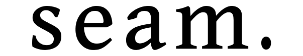

# Seam
Seam is a reactive state and animation library, useful in many contexts including UI and game mechanics.

Read everything you need to know about Seam on the documentation site: https://seam.igottic.com/

You can also install Seam from Wally. See info about that [here](https://wally.run/package/miagobble/seam?version=0.4.1).